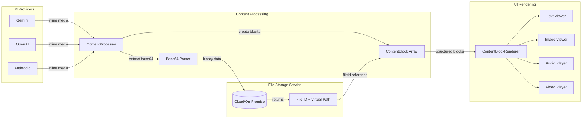

# Chat Response Resources

**Version:** 1.2
**Date:** 2026-01-28
**Status:** Draft

---

## Table of Contents

1. [Overview](#1-overview)
2. [Requirements](#2-requirements)
3. [Design Options](#3-design-options)
4. [Selected Approach: JSON Content Blocks](#4-selected-approach-json-content-blocks)
5. [Architecture](#5-architecture)
6. [Design](#6-design)
7. [Implementation](#7-implementation)

---

## 1. Overview

### Introduction

> **How do raw LLM responses become structured, displayable content?**

This document answers that question by defining the **Content Processing System** — the transformation layer that sits between LLM providers and the UI. It bridges the gap between:

- **system-file-handling.md** — How files are stored and managed
- **ui-threadpanel-overview.md** — How messages are displayed to users

The Content Processing System transforms unstructured LLM responses (which may contain embedded base64 media) into structured, typed content blocks that the UI can efficiently render.

### Content Processing Flow



### Core Purpose

The Content Processing System serves as the transformation layer that:

1. **Intercepts** raw LLM responses containing embedded base64 media
2. **Extracts** binary media data before it bloats IPC channels
3. **Stores** media via the File Storage Service with virtual paths
4. **Structures** content into typed blocks (text, image, audio, video, code)
5. **Provides** lightweight file ID references for efficient UI rendering

### Problem Statement

Chat providers (Gemini, OpenAI, Anthropic) return generated images, videos and audio as inline base64-encoded data within response content. These range from 2MB to 15MB, causing:

- **IPC bloat** — Large payloads slow token streaming
- **Memory pressure** — Multiple messages with media consume excessive RAM
- **Storage inefficiency** — Base64 encoding is 33% larger than binary
- **Render performance** — Re-parsing large strings on each render

### Solution

The Content Processing System addresses these issues by:

1. Intercepting base64 media data during streaming
2. Storing media in the File Storage Service with virtual paths
3. Replacing inline data with lightweight file ID references
4. Providing UI components access to media via file IDs

### File Types

This document addresses all four file types defined in **system-file-handling.md**:

| File Type | Description | Handling |
|-----------|-------------|----------|
| **User attachments** | Files attached by user to prompts | Stored via File Storage Service before sending to LLM |
| **Tool context files** | Files attached to context by tool functions | Referenced by virtual path, resolved via File Storage Service |
| **Tool-generated files** | Files generated by a tool function | Saved to File Storage Service, file ID returned to LLM |
| **LLM response files** | Files generated as part of LLM response (e.g., Gemini imagen) | Extracted from base64, stored via File Storage Service |

### Scope

| In Scope | Out of Scope |
|----------|--------------|
| Media extraction from all four file types | Media generation (provider-side) |
| File Storage Service integration | Media editing/manipulation |
| File ID generation and virtual paths | Command shell file access |
| UI file resolution | Direct physical path access |

### Related Documents

- **system-file-handling.md** — File types, virtual paths, File Storage Service, offline handling
- **system-thread-multiplexing.md** — Streaming architecture
- **ui-threadpanel-chatview.md** — Message rendering components
- **ui-threadpanel-overview.md** — Thread panel architecture
- **thread-repository-design.md** — Thread repository and data sync

---

## 2. Requirements

### 2.1 Functional Requirements

| ID | Requirement | Priority |
|----|-------------|----------|
| **FR-1** | Extract base64 media from streaming responses before IPC | CRITICAL |
| **FR-2** | Store extracted media via File Storage Service with virtual paths | CRITICAL |
| **FR-3** | Replace base64 data with file ID references in message content | CRITICAL |
| **FR-4** | Resolve file ID references to content in UI via File Storage Service | CRITICAL |
| **FR-5** | Preserve media metadata (dimensions, duration, format, alt text) | HIGH |
| **FR-6** | Support multiple media items per message | HIGH |
| **FR-7** | Clean up orphaned resources when messages are deleted | MEDIUM |
| **FR-8** | Support image formats: PNG, JPEG, GIF, WebP | HIGH |
| **FR-9** | Support audio formats: MP3, WAV, OGG, WebM | HIGH |
| **FR-10** | Support video formats: MP4, WebM, OGG | HIGH |

### 2.2 Non-Functional Requirements

| ID | Requirement | Target |
|----|-------------|--------|
| **NFR-1** | Extraction latency | < 50ms per media item |
| **NFR-2** | IPC message size with resources | < 100KB |
| **NFR-3** | File ID resolution time | < 10ms |
| **NFR-4** | Storage limits | Per system-file-handling.md (15MB max file, quotas per user/project) |

---

## 3. Design Options

### Option 1: Custom Protocol URL

Register an Electron protocol handler (e.g., `hkai://`) that serves media from cache.

**Format:**
```
hkai://media/{threadId}/{messageId}/{index}.png
```

**Pros:**
- Standard URL format, works directly in ``, `<audio>`, `<video>` elements
- Electron handles serving automatically
- No custom parsing in UI

**Cons:**
- Electron-specific (won't work in web build)
- Protocol registration adds complexity
- No metadata in reference

---

### Option 2: Resource URI with Markdown Syntax

Use markdown image syntax with a custom URI scheme.

**Format:**
```markdown

```

**Pros:**
- Markdown-compatible
- Clean separation of content and binary data
- Works in web builds

**Cons:**
- Requires custom markdown renderer hook
- No inline metadata (dimensions must be looked up)
- Resource registry must be available at render time

---

### Option 3: Custom HTML Tag

Use a self-closing tag with attributes for metadata.

**Format:**
```html
<hk-media id="a1b2c3d4" type="image" width="800" height="600" alt="Chart" format="png" />
```

**Pros:**
- Self-documenting (dimensions, format in tag)
- Easy to parse with regex or DOM parser
- Extensible attributes

**Cons:**
- Non-standard, may confuse external tools
- Content transformation required in renderer
- Still string-based parsing

---

### Option 4: JSON Content Blocks

Structure message content as an array of typed blocks.

**Format:**
```typescript
type ContentBlock = 
  | { type: 'text'; content: string }
  | { type: 'image'; fileId: string; mimeType: string; width: number; height: number; alt?: string }
  | { type: 'audio'; fileId: string; mimeType: string; duration?: number }
  | { type: 'video'; fileId: string; mimeType: string; width: number; height: number; duration?: number }
  | { type: 'code'; language: string; content: string };
```

**Pros:**
- Cleanest data model (typed, structured)
- No string parsing at render time
- Easy to query/filter by block type
- Extensible for future content types
- Works in all builds (Electron, web)

**Cons:**
- Breaking change to Message.content schema
- Requires migration for existing messages
- More complex initial implementation

---

### Option Comparison

| Aspect | Protocol | Resource URI | Custom Tag | JSON Blocks |
|--------|----------|--------------|------------|-------------|
| Schema change | None | None | None | **Yes** |
| Metadata in ref | ✗ | ✗ | ✓ | ✓ |
| Render complexity | Low | Medium | Medium | **Low** |
| Web build support | ✗ | ✓ | ✓ | ✓ |
| Extensibility | Low | Medium | Medium | **High** |
| Type safety | Low | Low | Medium | **High** |

### Selected Option

**Option 4: JSON Content Blocks** is selected for:
- Best long-term extensibility for multi-modal content
- Type-safe structured data
- No string parsing at render time
- Clean separation of concerns

---

## 4. Selected Approach: JSON Content Blocks

### Content Model

Messages transition from a single content string to an array of typed blocks:

```typescript
// Before: Message.content is a string
interface Message {
  content: string;  // "Here's the media: data:image/png;base64,iVBOR..."
}

// After: Message.content is structured
interface Message {
  content: ContentBlock[];
}

type ContentBlock = TextBlock | ImageBlock | AudioBlock | VideoBlock | CodeBlock;

interface TextBlock {
  type: 'text';
  content: string;  // Markdown/plain text
}

interface ImageBlock {
  type: 'image';
  fileId: string;          // Reference to File Storage Service
  virtualPath: string;     // Virtual path per system-file-handling.md
  mimeType: string;        // 'image/png', 'image/jpeg', etc.
  width: number;
  height: number;
  alt?: string;
  sourceField?: string;    // 'inlineData', 'url', etc. (for debugging)
}

interface AudioBlock {
  type: 'audio';
  fileId: string;
  virtualPath: string;
  mimeType: string;        // 'audio/mp3', 'audio/wav', etc.
  duration?: number;       // Duration in seconds
  sourceField?: string;
}

interface VideoBlock {
  type: 'video';
  fileId: string;
  virtualPath: string;
  mimeType: string;        // 'video/mp4', 'video/webm', etc.
  width: number;
  height: number;
  duration?: number;       // Duration in seconds
  sourceField?: string;
}

interface CodeBlock {
  type: 'code';
  language: string;
  content: string;
}
```

---

## 5. Architecture

### Component Overview

```
┌─────────────────────────────────────────────────────────────────────────┐
│                           MAIN PROCESS                                  │
│                                                                         │
│  ┌─────────────────┐    ┌─────────────────┐    ┌─────────────────────┐ │
│  │  Chat Provider  │───▶│ ContentProcessor│───▶│ File Storage Service│ │
│  │  (Gemini, etc.) │    │                 │    │                     │ │
│  │                 │    │ • Extract base64│    │ • Store to virtual  │ │
│  │ Returns raw     │    │ • Parse blocks  │    │   path              │ │
│  │ response with   │    │ • Create refs   │    │ • Generate file ID  │ │
│  │ inline media    │    │                 │    │ • Manage lifecycle  │ │
│  └─────────────────┘    └────────┬────────┘    └──────────┬──────────┘ │
│                                  │                        │            │
│                                  ▼                        │            │
│                         ┌─────────────────┐               │            │
│                         │ StreamManager   │               │            │
│                         │                 │               │            │
│                         │ Emits blocks    │               │            │
│                         │ (no base64)     │               │            │
│                         └────────┬────────┘               │            │
│                                  │                        │            │
└──────────────────────────────────┼────────────────────────┼────────────┘
                                   │ IPC                    │
                                   │ (lightweight)          │ Cloud/On-Premise
                                   ▼                        ▼
┌──────────────────────────────────────────────────────────────────────────┐
│                          RENDERER PROCESS                                │
│                                                                          │
│  ┌──────────────────┐    ┌──────────────────┐    ┌────────────────────┐ │
│  │ ChatStreamService│───▶│ChatMessageDisplay│───▶│ MediaViewer        │ │
│  │                  │    │                  │    │                    │ │
│  │ Receives blocks  │    │ Renders by type  │    │ Resolves fileId    │ │
│  │                  │    │                  │    │ via IPC            │ │
│  └──────────────────┘    └──────────────────┘    └────────────────────┘ │
│                                                                          │
└──────────────────────────────────────────────────────────────────────────┘
```

### Data Flow

1. **Provider Response** — Chat provider returns content with inline base64 media
2. **Content Processing** — `ContentProcessor` extracts media, stores via File Storage Service, creates blocks
3. **Streaming** — `StreamManager` emits lightweight blocks via IPC (no base64)
4. **Storage** — `ThreadRepository` persists blocks with file ID references
5. **Rendering** — UI iterates blocks, resolves file IDs via File Storage Service
6. **Display** — `MediaViewer` loads media content using file ID

### File Lifecycle

```
Created                    Active                     Cleanup
───────                    ──────                     ───────
Media extracted    ───▶    Referenced by message  ───▶   Message deleted
File ID generated          Rendered in UI              File soft deleted
Stored to virtual path     File accessed               Retention policy applied
```

### Offline Handling

When the File Storage Service is unavailable, the system follows the behavior defined in **system-file-handling.md**:

- Prompts can be submitted but file attachments are not supported
- LLM responses with files can be displayed temporarily but will not be persisted
- Files not stored will not be available on subsequent message display
- Desktop checks File Storage Service health on startup

---

## 6. Design

### 6.1 ContentProcessor

Transforms raw provider responses into structured content blocks.

```typescript
interface ContentProcessor {
  /**
   * Process raw content string, extracting resources and creating blocks
   */
  process(rawContent: string, context: ProcessContext): Promise<ProcessResult>;
}

interface ProcessContext {
  threadId: string;
  messageId: string;
  providerId: string;  // 'gemini', 'openai', 'anthropic'
}

interface ProcessResult {
  blocks: ContentBlock[];
  files: ExtractedFile[];
}

interface ExtractedFile {
  fileId: string;
  virtualPath: string;
  mimeType: string;
  size: number;
  width?: number;
  height?: number;
  duration?: number;
}
```

### 6.2 File Storage Service Integration

Integrates with the File Storage Service defined in **system-file-handling.md**.

```typescript
interface FileStorageService {
  store(data: Buffer, virtualPath: string, mimeType: string, metadata?: FileMetadata): Promise<string>;
  get(fileId: string): Promise<StoredFile | null>;
  getByPath(virtualPath: string): Promise<StoredFile | null>;
  delete(fileId: string): Promise<boolean>;
  getContent(fileId: string): Promise<Buffer | null>;
  isOnline(): Promise<boolean>;
}

interface StoredFile {
  fileId: string;
  virtualPath: string;
  fileName: string;
  mimeType: string;
  size: number;
  metadata?: FileMetadata;
  createdAt: string;
  updatedAt: string;
}

interface FileMetadata {
  width?: number;
  height?: number;
  duration?: number;
  alt?: string;
  threadId?: string;
  messageId?: string;
}
```

**Virtual Path Assignment:**
- General threads: `/user/{threadId}/{messageId}/{filename}`
- Projects: `/project/{threadId}/{messageId}/{filename}`

### 6.3 Gemini Inline Data Example

Gemini returns media in the `inlineData` field within content parts:

```json
{
  "candidates": [{
    "content": {
      "parts": [
        {
          "text": "Here's the chart you requested:\n\n"
        },
        {
          "inlineData": {
            "mimeType": "image/png",
            "data": "iVBORw0KGgoAAAANSUhEUgAABLAAAASwCAYAAAB..."
          }
        },
        {
          "text": "\n\nThe chart shows revenue growth of 15% over the 12-month period."
        }
      ]
    }
  }]
}
```

**After Processing:**

```typescript
const blocks: ContentBlock[] = [
  { 
    type: 'text', 
    content: "Here's the chart you requested:\n\n" 
  },
  { 
    type: 'image', 
    fileId: 'f47ac10b-58cc-4372-a567-0e02b2c3d479',
    virtualPath: '/user/thread-123/msg-456/chart.png',
    mimeType: 'image/png',
    width: 1200,
    height: 800,
    alt: 'Revenue chart',
    sourceField: 'inlineData'
  },
  { 
    type: 'text', 
    content: "\n\nThe chart shows revenue growth of 15% over the 12-month period." 
  }
];
```

---

## 7. Implementation

### 7.1 Type Definitions

```typescript
// src-electron/services/content/content-types.ts

export type ContentBlock = TextBlock | ImageBlock | AudioBlock | VideoBlock | CodeBlock;

export interface TextBlock {
  type: 'text';
  content: string;
}

export interface ImageBlock {
  type: 'image';
  fileId: string;
  virtualPath: string;
  mimeType: string;
  width: number;
  height: number;
  alt?: string;
  sourceField?: string;
}

export interface AudioBlock {
  type: 'audio';
  fileId: string;
  virtualPath: string;
  mimeType: string;
  duration?: number;
  sourceField?: string;
}

export interface VideoBlock {
  type: 'video';
  fileId: string;
  virtualPath: string;
  mimeType: string;
  width: number;
  height: number;
  duration?: number;
  sourceField?: string;
}

export interface CodeBlock {
  type: 'code';
  language: string;
  content: string;
}

export function isTextBlock(block: ContentBlock): block is TextBlock {
  return block.type === 'text';
}

export function isImageBlock(block: ContentBlock): block is ImageBlock {
  return block.type === 'image';
}

export function isAudioBlock(block: ContentBlock): block is AudioBlock {
  return block.type === 'audio';
}

export function isVideoBlock(block: ContentBlock): block is VideoBlock {
  return block.type === 'video';
}

export function isCodeBlock(block: ContentBlock): block is CodeBlock {
  return block.type === 'code';
}

export function isMediaBlock(block: ContentBlock): block is ImageBlock | AudioBlock | VideoBlock {
  return block.type === 'image' || block.type === 'audio' || block.type === 'video';
}
```

### 7.2 File Storage Service Wrapper

```typescript
// src-electron/services/files/file-storage-wrapper.ts

import { FileStorageService } from './file-storage-service.js';
import { randomUUID } from 'crypto';

/**
 * Wrapper for File Storage Service integration.
 * Uses cloud/on-premise backends per system-file-handling.md.
 */

let fileStorageService: FileStorageService;

export async function initialize(service: FileStorageService): Promise<void> {
  fileStorageService = service;
  // Verify service health on startup
  const isOnline = await service.isOnline();
  if (!isOnline) {
    console.warn('[FileStorage] Service offline - file operations will be limited');
  }
}

export async function store(
  data: Buffer,
  context: { threadId: string; messageId: string; isProject: boolean },
  mimeType: string,
  metadata?: { width?: number; height?: number; duration?: number }
): Promise<{ fileId: string; virtualPath: string }> {
  const ext = getExtensionFromMimeType(mimeType);
  const filename = `${randomUUID()}.${ext}`;
  
  // Build virtual path per system-file-handling.md
  const root = context.isProject ? '/project' : '/user';
  const virtualPath = `${root}/${context.threadId}/${context.messageId}/${filename}`;
  
  const fileId = await fileStorageService.store(data, virtualPath, mimeType, {
    width: metadata?.width,
    height: metadata?.height,
    duration: metadata?.duration,
    threadId: context.threadId,
    messageId: context.messageId
  });
  
  return { fileId, virtualPath };
}

function getExtensionFromMimeType(mimeType: string): string {
  const map: Record<string, string> = {
    'image/png': 'png',
    'image/jpeg': 'jpg',
    'image/gif': 'gif',
    'image/webp': 'webp',
    'audio/mpeg': 'mp3',
    'audio/wav': 'wav',
    'audio/ogg': 'ogg',
    'audio/webm': 'webm',
    'video/mp4': 'mp4',
    'video/webm': 'webm',
    'video/ogg': 'ogv',
  };
  return map[mimeType] || mimeType.split('/')[1] || 'bin';
}

export async function getContent(fileId: string): Promise<Buffer | null> {
  return fileStorageService.getContent(fileId);
}

export async function getMetadata(fileId: string): Promise<StoredFile | null> {
  return fileStorageService.get(fileId);
}

export async function remove(fileId: string): Promise<boolean> {
  return fileStorageService.delete(fileId);
}

export async function isOnline(): Promise<boolean> {
  return fileStorageService.isOnline();
}
```

### 7.3 ContentProcessor Implementation

```typescript
// src-electron/services/content/content-processor.ts

import * as FileStorage from '../files/file-storage-wrapper.js';
import { getMediaMetadata } from '../utils/media-utils.js';
import type { ContentBlock, ImageBlock, AudioBlock, VideoBlock } from './content-types.js';

interface ProcessContext {
  threadId: string;
  messageId: string;
  isProject: boolean;
}

const BASE64_MEDIA_REGEX = /data:(image|audio|video)\/([a-z0-9]+);base64,([A-Za-z0-9+/=]+)/g;

export async function processContent(
  rawContent: string,
  context: ProcessContext
): Promise<ContentBlock[]> {
  // Check if File Storage Service is online
  const isOnline = await FileStorage.isOnline();
  if (!isOnline) {
    // Return content as-is when offline (per system-file-handling.md)
    return [{ type: 'text', content: rawContent }];
  }

  const blocks: ContentBlock[] = [];
  let lastIndex = 0;
  let match: RegExpExecArray | null;
  
  BASE64_MEDIA_REGEX.lastIndex = 0;
  
  while ((match = BASE64_MEDIA_REGEX.exec(rawContent)) !== null) {
    if (match.index > lastIndex) {
      const text = rawContent.slice(lastIndex, match.index);
      if (text.trim()) {
        blocks.push({ type: 'text', content: text });
      }
    }
    
    const [fullMatch, mediaType, format, base64Data] = match;
    const mimeType = `${mediaType}/${format}`;
    const mediaBlock = await processBase64Media(base64Data, mimeType, mediaType, context);
    blocks.push(mediaBlock);
    
    lastIndex = match.index + fullMatch.length;
  }
  
  if (lastIndex < rawContent.length) {
    const text = rawContent.slice(lastIndex);
    if (text.trim()) {
      blocks.push({ type: 'text', content: text });
    }
  }
  
  if (blocks.length === 0) {
    blocks.push({ type: 'text', content: rawContent });
  }
  
  return blocks;
}

async function processBase64Media(
  base64Data: string, 
  mimeType: string, 
  mediaType: string,
  context: ProcessContext
): Promise<ImageBlock | AudioBlock | VideoBlock> {
  const buffer = Buffer.from(base64Data, 'base64');
  const metadata = await getMediaMetadata(buffer, mimeType);
  const { fileId, virtualPath } = await FileStorage.store(buffer, context, mimeType, metadata);
  
  if (mediaType === 'image') {
    return {
      type: 'image',
      fileId,
      virtualPath,
      mimeType,
      width: metadata?.width || 0,
      height: metadata?.height || 0
    };
  } else if (mediaType === 'audio') {
    return {
      type: 'audio',
      fileId,
      virtualPath,
      mimeType,
      duration: metadata?.duration
    };
  } else {
    return {
      type: 'video',
      fileId,
      virtualPath,
      mimeType,
      width: metadata?.width || 0,
      height: metadata?.height || 0,
      duration: metadata?.duration
    };
  }
}

// For Gemini-style responses with parts array
export async function processGeminiParts(
  parts: GeminiPart[],
  context: ProcessContext
): Promise<ContentBlock[]> {
  const isOnline = await FileStorage.isOnline();
  
  const blocks: ContentBlock[] = [];
  
  for (const part of parts) {
    if (part.text) {
      blocks.push({ type: 'text', content: part.text });
    } else if (part.inlineData && isOnline) {
      const buffer = Buffer.from(part.inlineData.data, 'base64');
      const mimeType = part.inlineData.mimeType;
      const mediaType = mimeType.split('/')[0];
      const metadata = await getMediaMetadata(buffer, mimeType);
      const { fileId, virtualPath } = await FileStorage.store(buffer, context, mimeType, metadata);
      
      if (mediaType === 'image') {
        blocks.push({
          type: 'image',
          fileId,
          virtualPath,
          mimeType,
          width: metadata?.width || 0,
          height: metadata?.height || 0,
          sourceField: 'inlineData'
        });
      } else if (mediaType === 'audio') {
        blocks.push({
          type: 'audio',
          fileId,
          virtualPath,
          mimeType,
          duration: metadata?.duration,
          sourceField: 'inlineData'
        });
      } else if (mediaType === 'video') {
        blocks.push({
          type: 'video',
          fileId,
          virtualPath,
          mimeType,
          width: metadata?.width || 0,
          height: metadata?.height || 0,
          duration: metadata?.duration,
          sourceField: 'inlineData'
        });
      }
    }
  }
  
  return blocks;
}

interface GeminiPart {
  text?: string;
  inlineData?: {
    mimeType: string;
    data: string;
  };
}
```

### 7.4 IPC Handlers

```typescript
// src-electron/ipc-handlers/file-handler.ts

import { ipcMain } from 'electron';
import * as FileStorage from '../services/files/file-storage-wrapper.js';

export function registerFileHandlers(): void {
  ipcMain.handle('file:getContent', async (_, fileId: string) => {
    const content = await FileStorage.getContent(fileId);
    return content ? content.toString('base64') : null;
  });
  
  ipcMain.handle('file:getMetadata', async (_, fileId: string) => {
    return FileStorage.getMetadata(fileId);
  });
  
  ipcMain.handle('file:getDataUrl', async (_, fileId: string) => {
    const metadata = await FileStorage.getMetadata(fileId);
    if (!metadata) return null;
    
    const content = await FileStorage.getContent(fileId);
    if (!content) return null;
    
    return `data:${metadata.mimeType};base64,${content.toString('base64')}`;
  });
  
  ipcMain.handle('file:isOnline', async () => {
    return FileStorage.isOnline();
  });
}
```

### 7.5 UI Components

```svelte
<!-- src/lib/components/ContentBlockRenderer.svelte -->
<script lang="ts">
  import type { ContentBlock } from '$electron/services/content/content-types.js';
  import MarkdownRenderer from './MarkdownRenderer.svelte';
  import ImageViewer from './ImageViewer.svelte';
  import AudioPlayer from './AudioPlayer.svelte';
  import VideoPlayer from './VideoPlayer.svelte';
  import CodeBlock from './CodeBlock.svelte';
  
  export let blocks: ContentBlock[];
</script>

{#each blocks as block}
  {#if block.type === 'text'}
    <MarkdownRenderer content={block.content} />
  {:else if block.type === 'image'}
    <ImageViewer 
      fileId={block.fileId} 
      width={block.width} 
      height={block.height}
      alt={block.alt}
    />
  {:else if block.type === 'audio'}
    <AudioPlayer 
      fileId={block.fileId}
      duration={block.duration}
    />
  {:else if block.type === 'video'}
    <VideoPlayer 
      fileId={block.fileId}
      width={block.width}
      height={block.height}
      duration={block.duration}
    />
  {:else if block.type === 'code'}
    <CodeBlock language={block.language} content={block.content} />
  {/if}
{/each}
```

```svelte
<!-- src/lib/components/ImageViewer.svelte -->
<script lang="ts">
  import { onMount } from 'svelte';
  
  export let fileId: string;
  export let width: number;
  export let height: number;
  export let alt: string = '';
  
  let src: string = '';
  let loading = true;
  let error: string | null = null;
  
  onMount(async () => {
    try {
      // Check if File Storage Service is online
      const isOnline = await window.electronAPI.file.isOnline();
      if (!isOnline) {
        error = 'File storage offline';
        return;
      }
      
      const dataUrl = await window.electronAPI.file.getDataUrl(fileId);
      if (dataUrl) {
        src = dataUrl;
      } else {
        error = 'File not found';
      }
    } catch (e) {
      error = e.message;
    } finally {
      loading = false;
    }
  });
</script>

<div class="image-container" style="--aspect: {width}/{height}">
  {#if loading}
    <div class="placeholder">Loading...</div>
  {:else if error}
    <div class="error">{error}</div>
  {:else}
    
  {/if}
</div>

<style>
  .image-container {
    aspect-ratio: var(--aspect);
    max-width: 100%;
  }
  img {
    max-width: 100%;
    height: auto;
    border-radius: 8px;
  }
</style>
```

---

## Appendix A: Migration Strategy

For existing messages with string content:

```typescript
function migrateContent(oldContent: string): ContentBlock[] {
  // Check if already migrated
  if (Array.isArray(oldContent)) {
    return oldContent;
  }
  
  // Simple migration: wrap in text block
  // Media in old messages remain as base64 (or process them)
  return [{ type: 'text', content: oldContent }];
}
```

---

## Appendix B: Preload API

```typescript
// preload.ts addition
file: {
  getContent: (fileId: string): Promise<string | null> =>
    ipcRenderer.invoke('file:getContent', fileId),
    
  getMetadata: (fileId: string): Promise<StoredFile | null> =>
    ipcRenderer.invoke('file:getMetadata', fileId),
    
  getDataUrl: (fileId: string): Promise<string | null> =>
    ipcRenderer.invoke('file:getDataUrl', fileId),
    
  isOnline: (): Promise<boolean> =>
    ipcRenderer.invoke('file:isOnline'),
}
```

---

**End of Document**
