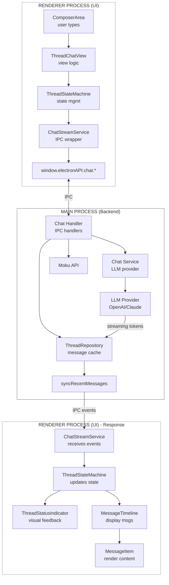

# Thread Panel Overview

**Version:** 1.1
**Date:** 2026-01-27
**Status:** Implementation Ready

---

## Related Documents

| Document | Description |
|----------|-------------|
| **ui-threadpanel-layout.md** | Component tree and file structure |
| **ui-threadpanel-components.md** | Header, tabs, status indicator, orchestrator |
| **ui-threadpanel-chatview.md** | Chat view and message timeline |
| **ui-threadpanel-execution-view.md** | Thread execution view |
| **ui-threadpanel-promptview.md** | Prompt list view |
| **system-branching-id.md** | Branch ID system specification |
| **thread-repository-design.md** | Thread repository and data sync design |
| **system-thread-multiplexing.md** | Multi-branch streaming architecture |

---

## 1. Architecture Overview

The Thread Panel provides a flexible layout and supporting archtiecture with these features:
- has multiple views of current thread where each view is tailored to specific task(s)
- supports real-time streaming update of the current thread containing one or more branches 
- provides feedback to user as prompt and response is processed 
- displays text, images, video and audio

### 1.1 Design Principles

- **Separation of Concerns:** Each component and service has a single, well-defined responsibility
- **Composition over Inheritance:** Views compose shared components rather than extending base classes
- **Testability:** All business logic extracted to services with pure functions where possible
- **Progressive Enhancement:** New component runs alongside old ChatPane during development
- **Type Safety:** Full TypeScript types throughout architecture

### 1.2 Key Architectural Decisions

| Decision | Rationale |
|----------|-----------|
| **Hybrid State Management** | Svelte stores for global state, component `$state` for local UI state |
| **Service Singletons** | Services instantiated as singletons, interact with stores |
| **4 Distinct Views** | Chat, Execution, Branching, Prompt - each with focused purpose |
| **Keyboard Toggle** | Cmd/Ctrl-Shift-T toggles between old/new during development |
| **Main Orchestrator Pattern** | ThreadComponent coordinates views, doesn't contain view logic |

### 1.3 Views Summary

| View | Purpose | Document |
|------|---------|----------|
| **Chat** | Message display, streaming, branching | ui-threadpanel-chatview.md |
| **Execution** | Run thread with instructions, history | ui-threadpanel-execution-view.md |
| **Branching** | SVG graph visualization of branches | See §3 below |
| **Prompt** | Compact prompt list with expand/collapse | ui-threadpanel-promptview.md |

---

## 2. Data Flow

This section describes the complete data flow through the Thread Panel, from user input to UI display. The architecture uses Electron IPC for communication between the renderer process (UI) and main process (backend services).

### 2.1 High-Level Flow Diagram



### 2.2 Send Message Flow (Detailed)

```
┌─────────────────────────────────────────────────────────────────────────────────────┐
│                              SEND MESSAGE FLOW                                      │
└─────────────────────────────────────────────────────────────────────────────────────┘

1. User types prompt in ComposerArea
   │
   ▼
2. User clicks Send (or presses Enter)
   │
   ▼
3. ThreadChatView.handleSendMessage(content)
   │  - Validates input
   │  - Gets current branchId from context
   │
   ▼
4. ThreadStateMachine.sendMessage(content, branchId)
   │  - Transitions to 'sending' state
   │  - Creates optimistic user message locally
   │
   ▼
5. ChatStreamService.startStream(threadId, branchId, content, messages)
   │  - Subscribes to branch if not already subscribed
   │  - Sets up IPC event listeners
   │
   ▼
6. window.electronAPI.chat.startBranched(threadId, branches)
   │
   ══════════════════════════════════════════════════════════ IPC BOUNDARY
   │
   ▼
7. Chat Handler (main process)
   │  - Receives IPC call
   │  - Validates request
   │
   ▼
8. ThreadRepository.appendMessageLocal(threadId, payload)
   │  - Generates clientMessageId
   │  - Uses 4-digit branchId (row.lane.message.tool_sequence)
   │  - Sets syncState = LOCAL_ONLY
   │  - Stores in local cache
   │
   ▼
9. Chat Service.chat(request, callbacks)
   │  - Calls LLM provider (OpenAI, Claude, etc.)
   │  - Registers token callback
   │  - Registers tool use callback
   │
   ▼
10. LLM Provider streams response
    │  - Tokens arrive incrementally
    │
    ▼
11. Chat Handler emits IPC events:
    │  - chat:token (each token)
    │  - chat:toolUse (tool calls)
    │  - chat:toolStatus (tool progress)
    │  - chat:complete (when done)
    │
    ══════════════════════════════════════════════════════════ IPC BOUNDARY
    │
    ▼
12. ChatStreamService receives events
    │  - onStreamMessage callback fires
    │  - Parses event type and payload
    │
    ▼
13. ThreadStateMachine.updateBranch(branchId, state)
    │  - Updates phase: 'receiving', 'tool_call', etc.
    │  - Accumulates streaming content
    │  - Updates status message
    │
    ▼
14. UI Components react to state changes:
    │  - ThreadStatusIndicator shows current phase
    │  - MessageTimeline displays streaming content
    │  - MessageItem renders markdown as tokens arrive
    │
    ▼
15. On chat:complete event:
    │
    ▼
16. ThreadRepository.syncRecentMessages(threadId)
    │  - Fetches last 50 messages from Moku API
    │  - Matches by clientMessageId
    │  - Replaces local messages with API versions
    │  - Sets syncState = SYNCED
    │
    ▼
17. ThreadStateMachine transitions to 'complete'
    │  - Clears streaming state
    │  - Updates branch phase to 'complete'
    │
    ▼
18. UI displays final message
```

### 2.3 Thread Loading Flow

```
┌─────────────────────────────────────────────────────────────────────────────────────┐
│                              THREAD LOADING FLOW                                    │
└─────────────────────────────────────────────────────────────────────────────────────┘

1. User selects thread from sidebar
   │
   ▼
2. ThreadStateMachine.selectThread(threadId, branchIds)
   │  - Transitions to 'loading' state
   │
   ▼
3. ChatStreamService.viewThread(threadId, branchIds, onUpdate)
   │
   ▼
4. Subscribe first: window.electronAPI.chat.subscribe(threadId, branchIds)
   │  - Establishes subscription BEFORE loading
   │  - Ensures no streaming events are missed
   │
   ▼
5. Load messages: window.electronAPI.threads.getMessages(threadId)
   │
   ══════════════════════════════════════════════════════════ IPC BOUNDARY
   │
   ▼
6. ThreadRepository.loadThread(threadId)
   │  - Checks cache first
   │  - If cached: calls syncRecentMessages()
   │  - If not cached: fetches from API
   │  - Orders messages by 4-digit branchId hierarchy
   │
   ▼
7. Returns messages to renderer
   │
   ══════════════════════════════════════════════════════════ IPC BOUNDARY
   │
   ▼
8. ChatStreamService.setupListener()
   │  - Sets up IPC listener for streaming events
   │
   ▼
9. ThreadStateMachine transitions to 'ready'
   │  - Stores messages in state
   │  - Populates activeBranches map
   │
   ▼
10. MessageTimeline renders messages
    │  - Messages ordered by branch hierarchy
    │  - Branch boxes rendered at fork points
```

### 2.4 Multi-Branch Streaming Flow

```
┌─────────────────────────────────────────────────────────────────────────────────────┐
│                              MULTI-BRANCH STREAMING                                 │
└─────────────────────────────────────────────────────────────────────────────────────┘

User creates model variation with 3 models: GPT-4, Claude, Gemini

1. ThreadStateMachine.sendBranchedMessage(content, models[])
   │
   ▼
2. ChatStreamService.startBranched(threadId, prompt, models, messages)
   │  - Creates branch entries for each model
   │  - Subscribes to all branch IDs
   │
   ▼
3. window.electronAPI.chat.startBranched(threadId, [
   │    { branchId: '3.0.0.0', model: 'gpt-4', ... },
   │    { branchId: '3.1.0.0', model: 'claude-sonnet', ... },
   │    { branchId: '3.2.0.0', model: 'gemini-pro', ... }
   │  ])
   │
   ══════════════════════════════════════════════════════════ IPC BOUNDARY
   │
   ▼
4. Chat Handler processes in parallel:
   │  - Spawns concurrent requests to each provider
   │  - Each stream emits events with its branchId
   │
   ▼
5. Events arrive interleaved:
   │  chat:token { branchId: '3.0.0.0', token: 'Hello' }
   │  chat:token { branchId: '3.1.0.0', token: 'Hi' }
   │  chat:token { branchId: '3.2.0.0', token: 'Greetings' }
   │  chat:token { branchId: '3.0.0.0', token: ' there' }
   │  ...
   │
   ══════════════════════════════════════════════════════════ IPC BOUNDARY
   │
   ▼
6. ChatStreamService routes by branchId:
   │  onUpdate(branchId, state) called for each
   │
   ▼
7. ThreadStateMachine.updateBranch(branchId, state)
   │  - Updates activeBranches Map
   │  - Each branch maintains independent:
   │    - phase (StreamPhase)
   │    - content (accumulated tokens)
   │    - statusMessage (display text)
   │
   ▼
8. UI displays all branches simultaneously:
   │  - BranchBox shows all 3 lanes
   │  - Each lane streams independently
   │  - ThreadStatusIndicator aggregates status
   │
   ▼
9. Branches complete independently:
   │  chat:complete { branchId: '3.1.0.0' }  (Claude finishes first)
   │  chat:complete { branchId: '3.0.0.0' }  (GPT-4 finishes)
   │  chat:complete { branchId: '3.2.0.0' }  (Gemini finishes)
   │
   ▼
10. ThreadStateMachine.hasActiveStreams becomes false when all complete
```

### 2.5 Key Components in Data Flow

| Component | Layer | Responsibility |
|-----------|-------|----------------|
| **ComposerArea** | UI | Captures user input, emits send events |
| **ThreadChatView** | UI | View-specific logic, coordinates child components |
| **ThreadStateMachine** | UI | State management, coordinates services |
| **ChatStreamService** | UI | Wraps all IPC chat calls, manages subscriptions |
| **window.electronAPI** | IPC | Preload script exposing IPC methods |
| **Chat Handler** | Backend | IPC handlers, coordinates backend services |
| **ThreadRepository** | Backend | Message caching, sync, branch ordering |
| **Chat Service** | Backend | LLM provider abstraction |
| **Moku API** | Backend | Remote API for persistence |

### 2.6 IPC Chat API

All chat IPC calls are made through ChatStreamService:

```typescript
// ChatStreamService methods → IPC calls
viewThread()      → chat.subscribe() + threads.getMessages()
startStream()     → chat.startBranched()
startBranched()   → chat.startBranched()
cancelBranch()    → chat.cancel()
cancelAll()       → chat.cancelThread()
cleanup()         → chat.unsubscribe()

// IPC events received
chat.onStreamMessage(callback) → receives all streaming events
```

---

## 3. State Management Overview

### 3.1 State Strategy

**Use Component State (`$state`) for:**
- UI-specific state (modal visibility, input focus)
- Temporary buffers (draft text, form inputs)
- Derived values specific to component (filtered lists)
- Animation state

**Use Store State for:**
- State that persists across view switches
- State shared between multiple components
- State that services need to read/write
- State that should be testable independently

### 3.2 Core Stores

| Store | Purpose | Location |
|-------|---------|----------|
| `threadViewState` | Active view, view history, scroll positions | thread-view.store.ts |
| `streamingState` | Streaming status, response text, errors | thread-view.store.ts |
| `threadStatusState` | Status indicator state machine | thread-view.store.ts |
| `branchSelectionState` | Active branch, selected IDs, hidden forks | thread-view.store.ts |

See **ui-threadpanel-components.md** for full store definitions.

---

## 4. Branching View (Brief)

**ThreadBranchingView.svelte** provides SVG-based branch visualization.

**Responsibilities:**
- Render SVG-based branch visualization
- Handle node clicks (navigate to message in Chat View)
- Show branch metadata (model, tokens, timing)
- Handle zoom/pan controls

**Graph Data Structure:**
```typescript
interface BranchGraphData {
  nodes: GraphNode[];
  edges: GraphEdge[];
}

interface GraphNode {
  id: string;           // message ID
  branchId: string;     // 4-digit format (see system-branching-id.md)
  position: { x: number; y: number };
  type: 'user' | 'assistant' | 'branch-point';
  metadata: {
    modelName?: string;
    tokens?: number;
    duration?: number;
    timestamp: number;
  };
}

interface GraphEdge {
  from: string;
  to: string;
  type: 'main' | 'branch' | 'selected';
}
```

**Layout Algorithm:**
- Tree layout (left-to-right or top-to-bottom)
- Branch lanes stacked vertically
- Tool iterations shown as micro-nodes
- Selected branches highlighted with thicker edges

**Size Estimate:** ~500 lines

---

## 5. Integration & Toggle

### 5.1 Keyboard Shortcut Toggle

**File:** `src/routes/+layout.svelte` (or app-level component)

```svelte
<script lang="ts">
  import { onMount } from 'svelte';
  import { writable } from 'svelte/store';

  // Global flag for toggling between old and new component
  export const useNewThreadComponent = writable(false);

  onMount(() => {
    function handleKeyDown(event: KeyboardEvent) {
      // Cmd-Shift-T (Mac) or Ctrl-Shift-T (Windows)
      if ((event.metaKey || event.ctrlKey) && event.shiftKey && event.key === 'T') {
        event.preventDefault();
        useNewThreadComponent.update(v => !v);
        console.log('[App] Toggled thread component:', !v);
      }
    }

    window.addEventListener('keydown', handleKeyDown);

    return () => {
      window.removeEventListener('keydown', handleKeyDown);
    };
  });
</script>
```

### 5.2 Conditional Rendering in Thread Route

**File:** `src/routes/thread/[id]/+page.svelte`

```svelte
<script lang="ts">
  import { useNewThreadComponent } from '../+layout.svelte';
  import ChatPane from '$lib/components/ChatPane.svelte';
  import ThreadComponent from '$lib/components/ThreadComponent.svelte';

  interface Props {
    thread: Thread;
    messages: Message[];
  }

  let { thread, messages }: Props = $props();
</script>

{#if $useNewThreadComponent}
  <ThreadComponent {thread} {messages} {composer}>
    {#snippet composer({ sendMessage, isStreaming, disabled })}
      <!-- Composer component here -->
    {/snippet}
  </ThreadComponent>
{:else}
  <ChatPane {thread} {messages} {composer}>
    {#snippet composer({ sendMessage, isStreaming, disabled })}
      <!-- Composer component here -->
    {/snippet}
  </ChatPane>
{/if}
```

### 5.3 Toast Notification on Toggle

```typescript
import { toast } from '$lib/stores/toast.store';

useNewThreadComponent.subscribe(value => {
  if (value) {
    toast.set('Switched to new Thread Component (Beta)');
  } else {
    toast.set('Switched to legacy Chat Pane');
  }
});
```

---

## 6. Size Summary

| Category | Lines |
|----------|-------|
| New code | ~5,000 |
| Reused code | ~1,500 |
| **Total** | ~6,500 |

**Key Improvement:** Main orchestrator reduced from 3,437 to ~800 lines (77% reduction)

---

**End of Document**
