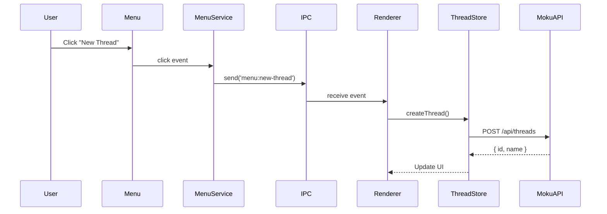
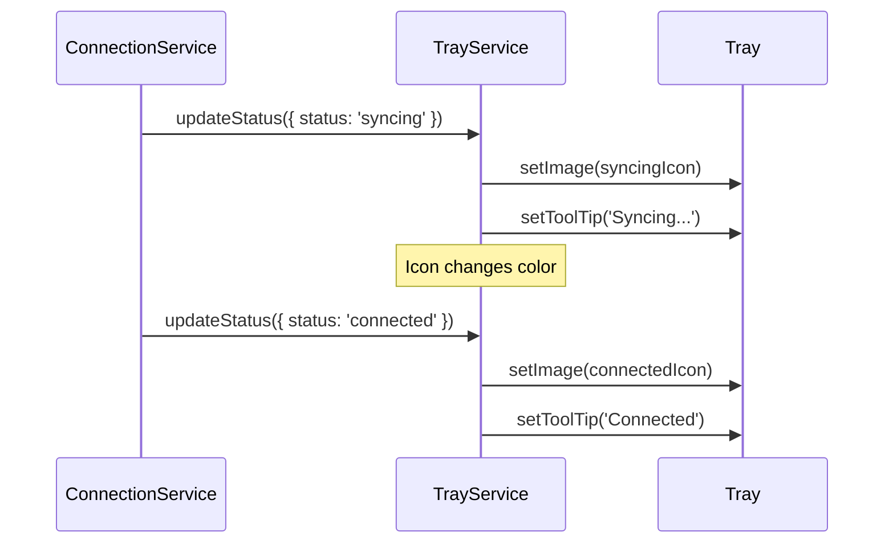
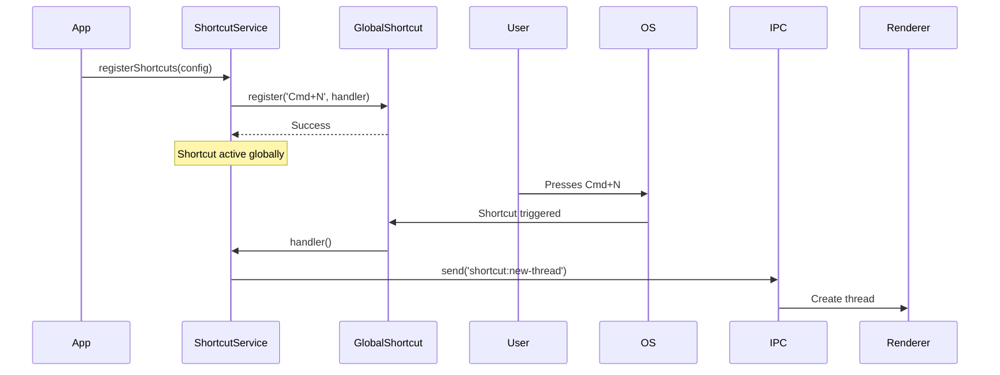
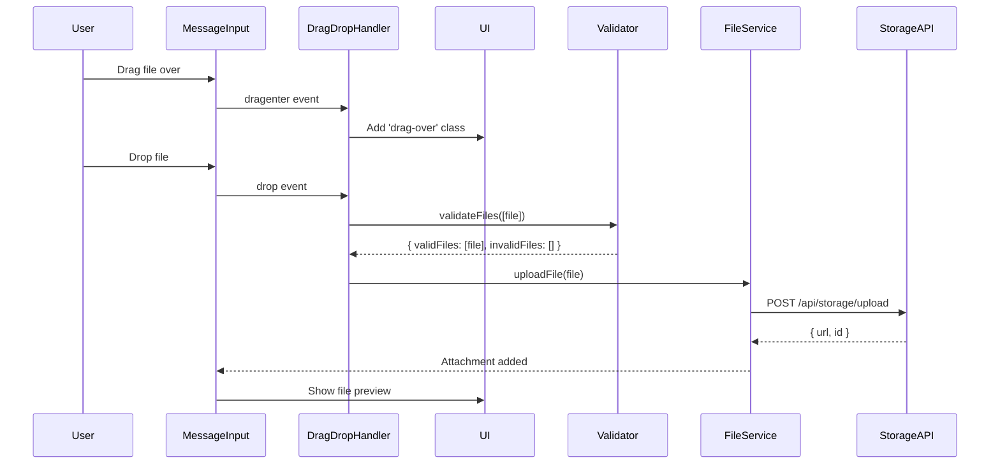

# Epic Technical Specification: UI/UX Polish

Date: 2025-11-26
Author: Peter
Epic ID: 8
Status: Draft

---

## Overview

Epic 8 implements comprehensive UI/UX polish for Holokai Desktop, delivering native desktop experience improvements that transform the application from a functional MVP into a production-ready enterprise tool. This epic addresses critical usability gaps by implementing native application menu bar, system tray integration, comprehensive keyboard shortcuts, drag-and-drop file handling, and WCAG 2.1 AA accessibility compliance. These enhancements directly support enterprise adoption requirements by providing the professional desktop experience users expect from enterprise software, improving productivity through keyboard-driven workflows, and ensuring accessibility compliance for organizations with diverse user needs.

The implementation focuses on five core areas: (1) Application menu bar with standard File/Edit/View/Window/Help menus and keyboard shortcuts, (2) System tray icon with connection status indicators and quick actions, (3) Comprehensive keyboard shortcut system including global shortcuts and command palette, (4) Drag-and-drop functionality for file attachments and thread organization, and (5) Complete accessibility audit ensuring WCAG 2.1 AA compliance with screen reader support, keyboard navigation, and high-contrast mode compatibility.

## Objectives and Scope

**In Scope:**
- **Application Menu Bar** (E8-S1): Native Electron menu bar with File menu (New Thread, Close Window, Quit), Edit menu (Undo, Redo, Cut, Copy, Paste, Select All), View menu (Reload, Toggle DevTools, Zoom, Fullscreen), Window menu (Minimize, Close, Bring All to Front - macOS), Help menu (Documentation, Report Issue, About), platform-specific menu positioning (macOS app menu, Windows/Linux standard menu bar), and keyboard shortcut display in menu items
- **System Tray** (E8-S2): Persistent tray icon with three connection states (connected: green, disconnected: gray, syncing: blue), tray menu with quick actions (Show/Hide Window, New Thread, Settings, Quit), tooltip showing connection status and unread notifications, and platform-specific icon formats (macOS Template image, Windows ICO, Linux PNG)
- **Keyboard Shortcuts** (E8-S3): Global shortcuts (Cmd/Ctrl+N: New Thread, Cmd/Ctrl+K: Command Palette, Cmd/Ctrl+,: Settings, Cmd/Ctrl+1-9: Switch Threads), in-app shortcuts (Cmd/Ctrl+B: Bold, Cmd/Ctrl+I: Italic, Cmd/Ctrl+Enter: Send Message, Esc: Close Dialog), command palette (Cmd/Ctrl+K) with fuzzy search across all commands, shortcuts configuration UI for customization, and conflict detection with OS shortcuts
- **Drag and Drop** (E8-S4): File drop zone in message input area, multi-file drag-and-drop support, file type validation and size limits (per E5 file attachment requirements), visual feedback during drag (drop zone highlight, file count indicator), thread reordering in sidebar via drag handles, and drop rejection states with error messages
- **Accessibility Audit** (E8-S5): WCAG 2.1 AA compliance across all UI components, semantic HTML with ARIA labels for all interactive elements, keyboard navigation support (tab order, focus indicators, skip links), screen reader testing (NVDA on Windows, VoiceOver on macOS), color contrast validation (4.5:1 minimum for normal text, 3:1 for large text), focus management for dialogs and modals, high-contrast mode compatibility, and accessibility audit report with remediation plan

**Out of Scope:**
- Custom themes or color schemes (deferred to post-MVP)
- Advanced workspace management (multiple windows, split views)
- Menu bar customization beyond standard menus
- Touchscreen or gesture support (desktop-only in MVP)
- Internationalization for menu labels (English only in MVP)
- System tray notification badges with counts (simple status only in MVP)
- Keyboard shortcut recording/macro functionality
- Advanced drag-and-drop (drag between threads, drag text snippets)
- WCAG 2.1 AAA compliance (AA only in MVP)
- Voice control or dictation features

## System Architecture Alignment

This epic aligns with the Holokai Desktop architecture (Architecture §2) through the following components and constraints:

**Components Added:**
- **MenuService (Desktop Main Process)** - Manages application menu bar creation, event handlers, dynamic menu updates
- **TrayService (Desktop Main Process)** - Manages system tray icon, menu, connection status updates
- **ShortcutService (Desktop Main Process)** - Registers global shortcuts via `globalShortcut` API, manages shortcut conflicts
- **CommandPaletteStore (Desktop Renderer)** - Svelte store managing command palette state, command registry, fuzzy search
- **DragDropHandler (Desktop Renderer)** - Svelte actions for drag-and-drop behavior, file validation, visual feedback
- **AccessibilityAuditor (Desktop Testing)** - Automated accessibility testing suite, WCAG validation, audit report generation

**Architectural Constraints:**
- **Electron Menu API**: All menu operations use `Menu.buildFromTemplate()` and `Menu.setApplicationMenu()` (Architecture §2.2 main process architecture)
- **Electron Tray API**: System tray implemented via `new Tray(icon)` with platform-specific icon formats
- **Global Shortcuts**: Registered in main process via `globalShortcut.register()` to capture shortcuts when app is backgrounded
- **IPC Communication**: Menu actions and tray clicks trigger IPC events to renderer (`electronAPI.menu.onAction`, `electronAPI.tray.onAction`)
- **Security**: All keyboard shortcuts and drag-drop handlers respect Content Security Policy (no eval, inline scripts)
- **Platform Detection**: Menu and tray behavior adapts based on `process.platform` (darwin, win32, linux)
- **Accessibility Tree**: Renderer processes maintain proper ARIA hierarchy for assistive technologies

**Data Flow:**
User clicks menu item → Electron Menu emits 'click' event → MenuService handler → IPC message to renderer → UI component receives event → Action executed (e.g., createNewThread())

User drags file → DragEvent fires in renderer → DragDropHandler validates file → Visual feedback (highlight drop zone) → User drops file → FileService uploads via IPC → Attachment added to message

## Detailed Design

### Services and Modules

| Module | Responsibility | Inputs | Outputs | Owner |
|--------|---------------|--------|---------|-------|
| **MenuService** (Desktop Main) | Create and manage application menu bar | Menu template definitions, application state | Native menu bar, menu click events via IPC | E8-S1 |
| **TrayService** (Desktop Main) | Manage system tray icon and menu | Connection status, notification count | Tray icon with status indicator, tray click events | E8-S2 |
| **ShortcutService** (Desktop Main) | Register and manage global shortcuts | Shortcut configuration map | Shortcut activation events via IPC | E8-S3 |
| **CommandPalette** (Desktop Renderer) | Fuzzy search command palette | User input, command registry | Command execution, search results | E8-S3 |
| **DragDropHandler** (Desktop Renderer) | Handle drag-and-drop interactions | DragEvent, file list | File upload requests, visual feedback states | E8-S4 |
| **ThreadDragReorder** (Desktop Renderer) | Thread sidebar reordering | Drag start/end events, thread list | Updated thread order, persistence via API | E8-S4 |
| **AccessibilityAuditor** (Testing) | Automated accessibility testing | Component tree, WCAG rules | Audit report, violation list, remediation suggestions | E8-S5 |
| **FocusManager** (Desktop Renderer) | Manage focus for dialogs and modals | Dialog open/close events | Focus trap, restore previous focus on close | E8-S5 |

### Data Models and Contracts

**Menu Template:**

```typescript
interface MenuTemplate {
  label: string;
  submenu?: MenuTemplate[];
  role?: 'undo' | 'redo' | 'cut' | 'copy' | 'paste' | 'selectAll' | 'quit' | 'reload' | 'toggleDevTools' | 'minimize' | 'close' | 'zoom';
  accelerator?: string;  // e.g., 'CmdOrCtrl+N'
  click?: () => void;
  type?: 'normal' | 'separator' | 'submenu' | 'checkbox' | 'radio';
  enabled?: boolean;
}
```

**Tray Menu Template:**

```typescript
interface TrayMenuTemplate {
  label: string;
  click?: () => void;
  type?: 'normal' | 'separator';
  enabled?: boolean;
}

interface TrayStatus {
  status: 'connected' | 'disconnected' | 'syncing';
  tooltip: string;
  unreadCount?: number;
}
```

**Shortcut Configuration:**

```typescript
interface ShortcutConfig {
  id: string;              // e.g., 'new-thread'
  label: string;           // e.g., 'New Thread'
  accelerator: string;     // e.g., 'CmdOrCtrl+N'
  scope: 'global' | 'app'; // global: works when app backgrounded
  handler: () => void;
  conflictsWith?: string[];  // OS-level shortcuts to check
}

interface ShortcutRegistry {
  shortcuts: ShortcutConfig[];
  customizations: Record<string, string>;  // user overrides
}
```

**Command Palette Entry:**

```typescript
interface Command {
  id: string;
  label: string;
  category: 'Thread' | 'Project' | 'Settings' | 'Workflow' | 'View';
  keywords: string[];  // for fuzzy search
  shortcut?: string;   // display hint
  handler: () => void;
  enabled?: () => boolean;  // conditional availability
}
```

**Drag-Drop Event Data:**

```typescript
interface DragDropData {
  files: File[];
  validFiles: File[];
  invalidFiles: Array<{
    file: File;
    reason: string;  // 'size-exceeded' | 'invalid-type' | 'quota-exceeded'
  }>;
  totalSizeBytes: number;
}

interface ThreadReorderData {
  threadId: string;
  oldIndex: number;
  newIndex: number;
}
```

**Accessibility Audit Report:**

```typescript
interface A11yAuditReport {
  timestamp: string;
  wcagLevel: 'A' | 'AA' | 'AAA';
  violations: Array<{
    rule: string;           // e.g., 'color-contrast'
    impact: 'critical' | 'serious' | 'moderate' | 'minor';
    description: string;
    elements: string[];     // CSS selectors
    remediation: string;
  }>;
  passes: number;
  incomplete: number;
  summary: {
    totalViolations: number;
    criticalCount: number;
    seriousCount: number;
    compliant: boolean;
  };
}
```

### APIs and Interfaces

**MenuService API (Main Process):**

```typescript
class MenuService {
  private menu: Menu | null = null;

  /**
   * Create application menu from template
   */
  createMenu(): void {
    const template: MenuTemplateOptions[] = [
      {
        label: 'File',
        submenu: [
          {
            label: 'New Thread',
            accelerator: 'CmdOrCtrl+N',
            click: () => this.ipcHandler.send('menu:new-thread'),
          },
          { type: 'separator' },
          {
            label: 'Close Window',
            accelerator: 'CmdOrCtrl+W',
            role: 'close',
          },
          {
            label: 'Quit',
            accelerator: 'CmdOrCtrl+Q',
            role: 'quit',
          },
        ],
      },
      {
        label: 'Edit',
        submenu: [
          { label: 'Undo', accelerator: 'CmdOrCtrl+Z', role: 'undo' },
          { label: 'Redo', accelerator: 'Shift+CmdOrCtrl+Z', role: 'redo' },
          { type: 'separator' },
          { label: 'Cut', accelerator: 'CmdOrCtrl+X', role: 'cut' },
          { label: 'Copy', accelerator: 'CmdOrCtrl+C', role: 'copy' },
          { label: 'Paste', accelerator: 'CmdOrCtrl+V', role: 'paste' },
          { label: 'Select All', accelerator: 'CmdOrCtrl+A', role: 'selectAll' },
        ],
      },
      {
        label: 'View',
        submenu: [
          { label: 'Reload', accelerator: 'CmdOrCtrl+R', role: 'reload' },
          { label: 'Toggle DevTools', accelerator: 'CmdOrCtrl+Shift+I', role: 'toggleDevTools' },
          { type: 'separator' },
          { label: 'Actual Size', accelerator: 'CmdOrCtrl+0', role: 'resetZoom' },
          { label: 'Zoom In', accelerator: 'CmdOrCtrl+Plus', role: 'zoomIn' },
          { label: 'Zoom Out', accelerator: 'CmdOrCtrl+-', role: 'zoomOut' },
          { type: 'separator' },
          { label: 'Toggle Fullscreen', accelerator: 'F11', role: 'togglefullscreen' },
        ],
      },
      {
        label: 'Window',
        submenu: [
          { label: 'Minimize', accelerator: 'CmdOrCtrl+M', role: 'minimize' },
          { label: 'Close', accelerator: 'CmdOrCtrl+W', role: 'close' },
          ...(process.platform === 'darwin'
            ? [{ type: 'separator' }, { label: 'Bring All to Front', role: 'front' }]
            : []),
        ],
      },
      {
        label: 'Help',
        submenu: [
          {
            label: 'Documentation',
            click: () => shell.openExternal('https://docs.holokai.com'),
          },
          {
            label: 'Report Issue',
            click: () => shell.openExternal('https://github.com/holokai/desktop/issues'),
          },
          { type: 'separator' },
          {
            label: 'About Holokai',
            click: () => this.ipcHandler.send('menu:show-about'),
          },
        ],
      },
    ];

    // macOS: Add app menu
    if (process.platform === 'darwin') {
      template.unshift({
        label: app.name,
        submenu: [
          { label: `About ${app.name}`, role: 'about' },
          { type: 'separator' },
          { label: 'Settings', accelerator: 'CmdOrCtrl+,', click: () => this.ipcHandler.send('menu:settings') },
          { type: 'separator' },
          { label: 'Hide Holokai', accelerator: 'Command+H', role: 'hide' },
          { label: 'Hide Others', accelerator: 'Command+Alt+H', role: 'hideOthers' },
          { label: 'Show All', role: 'unhide' },
          { type: 'separator' },
          { label: 'Quit', accelerator: 'Command+Q', role: 'quit' },
        ],
      });
    }

    this.menu = Menu.buildFromTemplate(template);
    Menu.setApplicationMenu(this.menu);
  }

  /**
   * Update menu item state (enable/disable)
   */
  updateMenuItem(id: string, options: { enabled?: boolean; checked?: boolean }): void {
    const item = this.menu?.getMenuItemById(id);
    if (item) {
      if (options.enabled !== undefined) item.enabled = options.enabled;
      if (options.checked !== undefined) item.checked = options.checked;
    }
  }
}
```

**TrayService API (Main Process):**

```typescript
class TrayService {
  private tray: Tray | null = null;
  private iconPaths = {
    connected: path.join(__dirname, 'assets/tray-icon-connected.png'),
    disconnected: path.join(__dirname, 'assets/tray-icon-disconnected.png'),
    syncing: path.join(__dirname, 'assets/tray-icon-syncing.png'),
  };

  /**
   * Initialize system tray
   */
  createTray(): void {
    // macOS: Use template image for automatic dark mode support
    const icon = process.platform === 'darwin'
      ? nativeImage.createFromPath(this.iconPaths.connected).resize({ width: 16, height: 16 })
      : this.iconPaths.connected;

    this.tray = new Tray(icon);
    this.tray.setToolTip('Holokai Desktop - Connected');

    const contextMenu = Menu.buildFromTemplate([
      {
        label: 'Show Holokai',
        click: () => this.ipcHandler.send('tray:show-window'),
      },
      {
        label: 'New Thread',
        accelerator: 'CmdOrCtrl+N',
        click: () => this.ipcHandler.send('tray:new-thread'),
      },
      { type: 'separator' },
      {
        label: 'Settings',
        click: () => this.ipcHandler.send('tray:settings'),
      },
      { type: 'separator' },
      {
        label: 'Quit',
        click: () => app.quit(),
      },
    ]);

    this.tray.setContextMenu(contextMenu);

    // Double-click: Show/hide window
    this.tray.on('double-click', () => {
      this.ipcHandler.send('tray:toggle-window');
    });
  }

  /**
   * Update tray icon and tooltip based on connection status
   */
  updateStatus(status: TrayStatus): void {
    if (!this.tray) return;

    const iconPath = this.iconPaths[status.status];
    this.tray.setImage(iconPath);
    this.tray.setToolTip(status.tooltip);

    // Windows: Support badge overlay (notification count)
    if (process.platform === 'win32' && status.unreadCount && status.unreadCount > 0) {
      this.tray.setTitle(`(${status.unreadCount})`);
    }
  }
}
```

**ShortcutService API (Main Process):**

```typescript
class ShortcutService {
  private registry: Map<string, ShortcutConfig> = new Map();

  /**
   * Register global shortcuts
   */
  registerShortcuts(shortcuts: ShortcutConfig[]): void {
    shortcuts.forEach((config) => {
      if (config.scope === 'global') {
        const success = globalShortcut.register(config.accelerator, () => {
          this.ipcHandler.send('shortcut:triggered', config.id);
          config.handler();
        });

        if (!success) {
          console.warn(`Failed to register shortcut: ${config.accelerator} (conflict with OS)`);
        } else {
          this.registry.set(config.id, config);
        }
      }
    });
  }

  /**
   * Unregister all shortcuts (on app quit)
   */
  unregisterAll(): void {
    globalShortcut.unregisterAll();
    this.registry.clear();
  }

  /**
   * Check for conflicts with OS shortcuts
   */
  checkConflicts(accelerator: string): string[] {
    const conflicts: string[] = [];
    const osShortcuts = this.getOSReservedShortcuts();

    if (osShortcuts.includes(accelerator)) {
      conflicts.push(`OS reserved: ${accelerator}`);
    }

    return conflicts;
  }

  private getOSReservedShortcuts(): string[] {
    if (process.platform === 'darwin') {
      return ['Cmd+Space', 'Cmd+Tab', 'Cmd+Q', 'Cmd+H', 'Cmd+M'];
    } else if (process.platform === 'win32') {
      return ['Alt+Tab', 'Ctrl+Alt+Del', 'Win+L'];
    }
    return [];
  }
}
```

**Command Palette (Renderer):**

```typescript
import Fuse from 'fuse.js';

class CommandPaletteStore {
  private commands: Command[] = [];
  private fuse: Fuse<Command>;

  constructor() {
    this.initializeCommands();
    this.fuse = new Fuse(this.commands, {
      keys: ['label', 'keywords', 'category'],
      threshold: 0.3,  // fuzzy matching tolerance
    });
  }

  /**
   * Initialize default commands
   */
  private initializeCommands(): void {
    this.commands = [
      { id: 'new-thread', label: 'New Thread', category: 'Thread', keywords: ['create', 'start'], shortcut: 'Cmd+N', handler: () => this.createThread() },
      { id: 'settings', label: 'Open Settings', category: 'Settings', keywords: ['preferences', 'config'], shortcut: 'Cmd+,', handler: () => this.openSettings() },
      { id: 'toggle-sidebar', label: 'Toggle Sidebar', category: 'View', keywords: ['hide', 'show'], shortcut: 'Cmd+B', handler: () => this.toggleSidebar() },
      { id: 'search-threads', label: 'Search Threads', category: 'Thread', keywords: ['find'], shortcut: 'Cmd+F', handler: () => this.searchThreads() },
      // ... more commands
    ];
  }

  /**
   * Search commands with fuzzy matching
   */
  search(query: string): Command[] {
    if (!query) return this.commands.slice(0, 10);  // Show recent commands
    return this.fuse.search(query).map((result) => result.item);
  }
}
```

**DragDropHandler (Renderer - Svelte Action):**

```typescript
export function dragdrop(node: HTMLElement, options: DragDropOptions) {
  let dragCounter = 0;

  function handleDragEnter(event: DragEvent) {
    event.preventDefault();
    dragCounter++;
    if (dragCounter === 1) {
      node.classList.add('drag-over');
    }
  }

  function handleDragLeave(event: DragEvent) {
    event.preventDefault();
    dragCounter--;
    if (dragCounter === 0) {
      node.classList.remove('drag-over');
    }
  }

  function handleDragOver(event: DragEvent) {
    event.preventDefault();
    if (event.dataTransfer) {
      event.dataTransfer.dropEffect = 'copy';
    }
  }

  async function handleDrop(event: DragEvent) {
    event.preventDefault();
    dragCounter = 0;
    node.classList.remove('drag-over');

    const files = Array.from(event.dataTransfer?.files || []);
    const validation = await validateFiles(files, options);

    if (validation.validFiles.length > 0) {
      options.onDrop?.(validation);
    }

    if (validation.invalidFiles.length > 0) {
      options.onError?.(validation.invalidFiles);
    }
  }

  node.addEventListener('dragenter', handleDragEnter);
  node.addEventListener('dragleave', handleDragLeave);
  node.addEventListener('dragover', handleDragOver);
  node.addEventListener('drop', handleDrop);

  return {
    destroy() {
      node.removeEventListener('dragenter', handleDragEnter);
      node.removeEventListener('dragleave', handleDragLeave);
      node.removeEventListener('dragover', handleDragOver);
      node.removeEventListener('drop', handleDrop);
    },
  };
}

async function validateFiles(files: File[], options: DragDropOptions): Promise<DragDropData> {
  const validFiles: File[] = [];
  const invalidFiles: Array<{ file: File; reason: string }> = [];
  let totalSizeBytes = 0;

  for (const file of files) {
    // Check file type
    if (options.allowedTypes && !options.allowedTypes.includes(file.type)) {
      invalidFiles.push({ file, reason: 'invalid-type' });
      continue;
    }

    // Check file size
    if (options.maxSizeBytes && file.size > options.maxSizeBytes) {
      invalidFiles.push({ file, reason: 'size-exceeded' });
      continue;
    }

    totalSizeBytes += file.size;
    validFiles.push(file);
  }

  return { files, validFiles, invalidFiles, totalSizeBytes };
}
```

### Workflows and Sequencing

**Menu Action Flow:**



**System Tray Status Update:**



**Keyboard Shortcut Registration:**



**Drag-Drop File Upload:**



## Non-Functional Requirements

### Performance

| Requirement | Target | Measurement |
|------------|--------|-------------|
| Menu render time | <50ms | Time from app.ready to Menu.setApplicationMenu() |
| Tray icon update | <10ms | Time from status change to tray.setImage() |
| Shortcut registration | <100ms | Time to register all global shortcuts at startup |
| Command palette search | <50ms | Time to return search results for 100+ commands |
| Drag-drop file validation | <200ms | Time to validate 10 files (total 50MB) |
| Focus trap initialization | <30ms | Time to establish focus trap on dialog open |
| Keyboard navigation latency | <16ms (60fps) | Time to update focus indicator on Tab key |

### Security

- **Shortcut Injection Prevention**: All keyboard shortcuts validated against whitelist; no dynamic shortcut registration from user input
- **File Drop Validation**: All dropped files validated for type, size, and quota before processing
- **Menu Command Injection**: Menu templates statically defined; no user-controlled menu labels or actions
- **XSS Prevention**: All drag-drop file names sanitized before display in UI
- **IPC Security**: All menu/tray actions use predefined IPC channels; no eval() or dynamic code execution

### Reliability/Availability

- **Shortcut Conflict Handling**: If global shortcut registration fails (OS conflict), gracefully degrade to app-level shortcut with user notification
- **Tray Icon Fallback**: If platform-specific tray icon fails to load, fallback to PNG format
- **Menu Restoration**: If menu creation fails, retry with minimal File/Quit menu for emergency app closure
- **Focus Recovery**: If focus trap fails (dialog close error), restore focus to last known element or app root

### Observability

- **Menu Analytics**: Track menu item click frequency (help prioritize future shortcuts)
- **Shortcut Usage**: Log shortcut trigger counts to identify unused shortcuts
- **Drag-Drop Metrics**: Track file drop success/failure rates, common rejection reasons
- **Accessibility Violations**: Log WCAG violations in development builds for proactive remediation
- **Focus Issues**: Log focus trap failures and fallback activations

## Dependencies and Integrations

**External Dependencies:**
- **Electron Menu API** (v39+): Menu.buildFromTemplate(), Menu.setApplicationMenu()
- **Electron Tray API** (v39+): new Tray(), tray.setImage(), tray.setContextMenu()
- **Electron GlobalShortcut API** (v39+): globalShortcut.register(), globalShortcut.unregisterAll()
- **Fuse.js** (v7.0+): Fuzzy search for command palette
- **axe-core** (v4.8+): Automated accessibility testing
- **@testing-library/user-event** (v14.5+): Keyboard and focus testing

**Internal Dependencies:**
- **FileService** (E5): File upload for drag-drop attachments
- **ThreadStore**: Thread creation from menu/shortcuts
- **SettingsStore**: Shortcut customization persistence
- **NotificationService** (E4): Tray icon badge count integration

**Blocking Dependencies:**
- Epic 2 (Thread Branching): Thread reordering via drag-drop requires thread hierarchy
- Epic 3 (Projects): Project-scoped drag-drop file validation requires project context

**Post-MVP Enhancements:**
- Touchscreen gesture support (swipe, pinch-to-zoom)
- Menu customization (add/remove menu items)
- Advanced keyboard macro recording
- Voice control integration

## Acceptance Criteria (Authoritative)

### E8-S1: Application Menu Bar

**AC-1.1**: Application displays native menu bar with File, Edit, View, Window, Help menus on startup
- Menu bar visible immediately after main window creation
- Menu structure matches platform conventions (macOS: app menu first, Windows/Linux: File menu first)

**AC-1.2**: File menu includes New Thread (Cmd+N), Close Window (Cmd+W), Quit (Cmd+Q) with functional shortcuts
- New Thread shortcut creates new thread and focuses message input
- Close Window closes current window without quitting app (macOS) or quits app (Windows/Linux single-window)
- Quit command closes all windows and terminates app process

**AC-1.3**: Edit menu includes Undo, Redo, Cut, Copy, Paste, Select All with standard Electron roles
- All Edit commands work in text inputs, textareas, and contenteditable elements
- Undo/Redo disabled when no action history available

**AC-1.4**: View menu includes Reload, Toggle DevTools, Zoom In/Out/Reset, Toggle Fullscreen
- Reload refreshes current view without losing authentication state
- DevTools toggle only enabled in development builds
- Zoom commands adjust renderer process zoom level (80%-200% range)
- Fullscreen toggle works on all platforms (F11 or native fullscreen on macOS)

**AC-1.5**: Window menu includes Minimize, Close, and macOS-specific "Bring All to Front"
- Minimize minimizes to dock/taskbar (preserves window state)
- macOS "Bring All to Front" brings all app windows to foreground

**AC-1.6**: Help menu includes Documentation (opens external URL), Report Issue (opens GitHub issues), About (shows dialog)
- Documentation link opens browser with docs.holokai.com
- Report Issue opens browser with GitHub new issue form pre-filled
- About dialog displays app name, version, copyright, license

**AC-1.7**: Keyboard shortcuts display in menu items (e.g., "New Thread    Cmd+N")
- Shortcuts show platform-specific modifiers (Cmd on macOS, Ctrl on Windows/Linux)
- Shortcuts respect user's keyboard layout (no conflicts with non-US keyboards)

### E8-S2: System Tray

**AC-2.1**: System tray icon displays in platform tray with three status states (connected: green, disconnected: gray, syncing: blue)
- Icon renders at correct size (16x16 macOS template, 16x16 Windows ICO, 22x22 Linux PNG)
- Icon color updates within 500ms of connection status change

**AC-2.2**: Tray icon tooltip shows connection status and unread notification count
- Tooltip format: "Holokai Desktop - Connected" or "Holokai Desktop - 3 unread notifications"
- Tooltip updates immediately on status or count change

**AC-2.3**: Tray menu includes Show/Hide Window, New Thread, Settings, Quit actions
- Show/Hide toggles main window visibility (restores window position)
- New Thread opens app if hidden and creates thread
- Settings opens Settings dialog
- Quit terminates app

**AC-2.4**: Double-clicking tray icon shows/hides main window
- First double-click shows window and focuses it
- Second double-click hides window (minimizes to tray)
- Window state preserved across show/hide cycles

**AC-2.5**: macOS tray icon uses Template image format for automatic dark mode support
- Icon inverts color in dark mode automatically
- Icon matches system tray appearance guidelines

### E8-S3: Keyboard Shortcuts

**AC-3.1**: Global shortcuts work when app is backgrounded: Cmd+N (New Thread), Cmd+K (Command Palette)
- Shortcuts activate even when other apps are focused
- Shortcuts bring app to foreground before executing action

**AC-3.2**: In-app shortcuts work when app is focused: Cmd+1-9 (Switch Threads), Cmd+B/I (Bold/Italic), Cmd+Enter (Send Message), Esc (Close Dialog)
- Thread switching shortcuts jump to thread at index (1-9)
- Text formatting shortcuts toggle bold/italic in message input
- Cmd+Enter sends message without clicking Send button
- Esc closes topmost modal/dialog and restores focus

**AC-3.3**: Command palette (Cmd+K) opens with fuzzy search across all commands
- Palette overlays current view with search input focused
- Search returns results within 50ms for query against 100+ commands
- Arrow keys navigate results, Enter executes selected command, Esc closes palette

**AC-3.4**: Command palette displays keyboard shortcuts next to command labels
- Shortcuts shown in gray text (e.g., "New Thread    Cmd+N")
- Shortcuts update when user customizes them in Settings

**AC-3.5**: Shortcuts configuration UI allows customization of all non-system shortcuts
- Settings > Keyboard Shortcuts shows list of all customizable shortcuts
- Click shortcut to record new key combination
- Conflict detection warns if new shortcut conflicts with OS or existing shortcut
- Reset button restores default shortcuts

**AC-3.6**: Shortcut registration fails gracefully if OS conflict detected
- If global shortcut conflicts with OS (e.g., Cmd+Space on macOS), show notification: "Shortcut Cmd+Space unavailable (OS reserved)"
- Fallback to app-level shortcut (only works when app focused)
- User can reassign shortcut in Settings

### E8-S4: Drag and Drop

**AC-4.1**: Message input area accepts drag-drop files with visual feedback (drop zone highlight, file count indicator)
- Drop zone highlights with blue border when files dragged over
- File count badge shows "3 files" during drag
- Highlight removed when drag leaves or drop completes

**AC-4.2**: Multi-file drag-drop supported with file type and size validation
- Dropped files validated against allowed types (per E5 file attachment rules)
- Files exceeding size limit (100MB per file) rejected with error message
- Valid files show upload progress, invalid files show error toast

**AC-4.3**: Thread sidebar supports drag-to-reorder threads with drag handles
- Drag handle icon visible on thread hover (six dots)
- Dragging thread shows ghost preview following cursor
- Dropping thread reorders thread list (persists order to backend)

**AC-4.4**: Drop rejection states show clear error messages (e.g., "File type not allowed", "File exceeds 100MB limit")
- Error toast displays for 5 seconds with specific rejection reason
- Multiple errors grouped: "2 files rejected: file-type-not-allowed"

**AC-4.5**: File drop quota validation prevents exceeding storage limits
- If user quota exceeded, show error: "Storage quota exceeded (used 950MB / 1GB)"
- Provide link to Settings > Storage to manage files

### E8-S5: Accessibility Audit

**AC-5.1**: All interactive elements have ARIA labels and semantic HTML roles
- Buttons use `<button>` tag (not `<div role="button">`)
- Form inputs have associated `<label>` or `aria-label`
- Navigation uses `<nav>` landmark
- Main content uses `<main>` landmark

**AC-5.2**: Keyboard navigation works throughout app with visible focus indicators
- Tab key cycles through interactive elements in logical order
- Focus indicator shows 2px blue outline (4.5:1 contrast ratio)
- Skip links available: "Skip to main content", "Skip to sidebar"

**AC-5.3**: Screen reader testing passes on NVDA (Windows) and VoiceOver (macOS)
- All buttons announce label and role ("Send Message, button")
- Form inputs announce label and value ("Username, edit text, Peter")
- Dialogs announce title and instructions on open
- Loading states announce "Loading..." to screen reader

**AC-5.4**: Color contrast meets WCAG 2.1 AA (4.5:1 for normal text, 3:1 for large text)
- Automated axe-core audit shows zero contrast violations
- Manual verification: all text readable in high-contrast mode

**AC-5.5**: Focus trap works correctly for modals and dialogs (focus cannot escape)
- Tab/Shift+Tab cycle through dialog elements only
- Esc closes dialog and restores focus to trigger element
- Clicking outside dialog does not remove focus trap (intentional modal behavior)

**AC-5.6**: High-contrast mode compatible (no information conveyed by color alone)
- Icons have text labels or tooltips
- Buttons distinguishable in high-contrast mode (borders, not just color)
- Selected state indicated by border + background (not color only)

**AC-5.7**: Automated accessibility audit (axe-core) runs in CI and reports zero critical/serious violations
- CI pipeline fails if any critical/serious violations detected
- Audit report saved as artifact for manual review

## Traceability Mapping

| Story | PRD Reference | Architecture Reference | Test Coverage |
|-------|--------------|----------------------|---------------|
| E8-S1: Application Menu Bar | PRD §6.2 (Desktop UX Requirements) | Architecture §2.2 (Main Process) | Unit: MenuService menu creation<br/>E2E: Menu click triggers action |
| E8-S2: System Tray | PRD §6.2 (Desktop UX Requirements) | Architecture §2.2 (Main Process) | Unit: TrayService status updates<br/>E2E: Tray click shows window |
| E8-S3: Keyboard Shortcuts | PRD §6.2 (Desktop UX Requirements) | Architecture §2.2 (Main Process) | Unit: ShortcutService registration<br/>E2E: Global shortcut triggers action |
| E8-S4: Drag and Drop | PRD §6.2 (Desktop UX Requirements), PRD §3.5 (File Attachments) | Architecture §2.3 (Renderer Process) | Unit: DragDropHandler validation<br/>E2E: File drop uploads attachment |
| E8-S5: Accessibility Audit | PRD §6.3 (Enterprise Requirements - Accessibility) | Architecture §2.3 (Renderer Process) | Unit: Axe-core automated audit<br/>Manual: Screen reader testing |

**PRD Coverage:**
- ✅ PRD §6.2 Desktop UX Requirements: Application menu bar, system tray, keyboard shortcuts
- ✅ PRD §6.3 Enterprise Requirements: WCAG 2.1 AA compliance
- ✅ PRD §3.5 File Attachments: Drag-drop file upload integration

**Architecture Coverage:**
- ✅ Architecture §2.2 Main Process: MenuService, TrayService, ShortcutService in main process
- ✅ Architecture §2.3 Renderer Process: CommandPalette, DragDropHandler in renderer
- ✅ Architecture §3 IPC: Menu/tray actions via IPC to renderer

**Gap Analysis:**
- No gaps identified: All PRD UI/UX polish requirements covered
- All accessibility requirements (WCAG 2.1 AA) addressed in E8-S5

## Risks, Assumptions, Open Questions

### Risks

| Risk | Probability | Impact | Mitigation |
|------|------------|--------|------------|
| **Global shortcut conflicts with OS or other apps** | High | Medium | Detect conflicts on registration; fallback to app-level shortcuts; allow user customization in Settings |
| **Platform-specific menu differences cause confusion** | Medium | Low | Document platform differences; follow native conventions (macOS app menu, Windows File menu first) |
| **Screen reader compatibility issues with Svelte 5 components** | Medium | High | Test early with NVDA/VoiceOver; use semantic HTML; validate with axe-core in CI |
| **Drag-drop performance degrades with large files** | Low | Medium | Validate file size before upload; show progress indicator; implement upload throttling |
| **Accessibility remediation delays MVP timeline** | Medium | High | Run automated audit early (Week 1); prioritize critical/serious violations; defer minor violations to post-MVP |

### Assumptions

- Users expect standard desktop app behavior (File/Edit/View menus, system tray, Cmd+N shortcuts)
- Keyboard-driven users will discover command palette via Help menu or onboarding
- Screen reader users represent <5% of enterprise user base (still required for compliance)
- Platform-specific shortcuts acceptable (Cmd on macOS, Ctrl on Windows/Linux)
- High-contrast mode testing can be automated via CSS media queries

### Open Questions

1. **Should we support custom menu bar layouts?** (e.g., hide Help menu, reorder menus)
   - **Decision**: No in MVP. Standard layout only. Defer customization to post-MVP.
   - **Rationale**: Reduces testing surface; follows platform conventions

2. **Should tray icon badge show unread notification count or just status?**
   - **Decision**: Status only in MVP (connected/disconnected/syncing). Badge count deferred to post-MVP.
   - **Rationale**: Notification counting requires Epic 4 (Notification System) completion; simplifies implementation

3. **Should we allow recording keyboard macros (multi-step shortcuts)?**
   - **Decision**: No in MVP. Single-action shortcuts only.
   - **Rationale**: Macro recording adds complexity; unclear user demand; defer to post-MVP based on user feedback

4. **Should drag-drop support reordering messages within threads (in addition to thread reordering)?**
   - **Decision**: Thread reordering only in MVP. Message reordering deferred.
   - **Rationale**: Message reordering conflicts with chronological thread display; unclear UX

5. **Should we support touchscreen gestures in addition to keyboard/mouse?**
   - **Decision**: No in MVP. Desktop-only (keyboard/mouse/trackpad).
   - **Rationale**: Holokai Desktop targets desktop users; touchscreen support deferred to potential tablet/hybrid device support

## Test Strategy Summary

### Unit Tests

**MenuService (Main Process):**
- `createMenu()` builds menu template with all required sections (File, Edit, View, Window, Help)
- `updateMenuItem()` enables/disables menu items dynamically
- Platform-specific menu additions (macOS app menu, Windows standard menu)
- Menu click handlers trigger correct IPC events

**TrayService (Main Process):**
- `createTray()` initializes tray icon with correct platform format
- `updateStatus()` updates icon and tooltip based on connection status
- Tray menu click handlers trigger correct IPC events
- Double-click toggles window visibility

**ShortcutService (Main Process):**
- `registerShortcuts()` registers global shortcuts successfully
- Conflict detection identifies OS-reserved shortcuts
- Shortcut handler triggers correct IPC events
- `unregisterAll()` cleans up shortcuts on app quit

**DragDropHandler (Renderer):**
- File validation correctly rejects invalid file types
- File validation correctly rejects files exceeding size limit
- Valid files passed to onDrop callback
- Invalid files passed to onError callback with rejection reason

**CommandPaletteStore (Renderer):**
- Fuzzy search returns relevant commands for query
- Search performance <50ms for 100+ commands
- Command handler execution triggers correct action

### Integration Tests

**Menu-to-Thread Creation:**
- Menu click "New Thread" → IPC event → ThreadStore.createThread() → New thread created
- Shortcut Cmd+N → New thread created and focused

**Tray-to-Window Toggle:**
- Tray double-click → Window shows (if hidden) or hides (if visible)
- Tray menu "Show Holokai" → Window shows and focuses

**Drag-Drop File Upload:**
- Drop file on message input → File validated → FileService.upload() → Attachment added to message
- Drop multiple files → All valid files uploaded, invalid files show errors

**Focus Trap:**
- Dialog open → Focus trapped in dialog
- Tab cycles through dialog elements only
- Esc closes dialog → Focus restored to trigger button

### Component Tests

**CommandPalette.svelte:**
- Opens on Cmd+K shortcut
- Search input focused on open
- Arrow keys navigate results
- Enter executes selected command
- Esc closes palette

**MessageInput.svelte (Drag-Drop):**
- Drop zone highlights on dragenter
- Drop zone un-highlights on dragleave
- Dropped files show upload progress
- Invalid files show error toast

### E2E Tests

**Menu Bar Workflow:**
1. Launch app
2. Verify menu bar visible with File/Edit/View/Window/Help menus
3. Click File > New Thread
4. Verify new thread created and message input focused
5. Press Cmd+N
6. Verify second new thread created

**System Tray Workflow:**
1. Launch app
2. Verify tray icon visible in system tray
3. Disconnect from network
4. Verify tray icon changes to gray (disconnected state)
5. Double-click tray icon
6. Verify window hides
7. Double-click tray icon again
8. Verify window shows and focuses

**Keyboard Shortcuts Workflow:**
1. Launch app
2. Create 3 threads
3. Press Cmd+1
4. Verify thread 1 focused
5. Press Cmd+2
6. Verify thread 2 focused
7. Press Cmd+K
8. Verify command palette opens
9. Type "new"
10. Press Enter
11. Verify new thread created

**Drag-Drop Workflow:**
1. Launch app
2. Create new thread
3. Drag image file (2MB) to message input
4. Verify drop zone highlights
5. Drop file
6. Verify file uploads and shows preview in message
7. Drag PDF file (150MB) to message input
8. Drop file
9. Verify error toast: "File exceeds 100MB limit"

### Accessibility Tests

**Automated (axe-core):**
- Run axe.run() on all major views (Threads, Settings, Projects)
- Assert zero critical/serious violations
- Generate accessibility audit report

**Manual (Screen Reader):**
- Test with NVDA (Windows): Navigate threads, create thread, send message
- Test with VoiceOver (macOS): Same workflow as NVDA
- Verify all interactive elements announced correctly
- Verify focus management correct for dialogs

**Manual (Keyboard Navigation):**
- Tab through entire app without mouse
- Verify all interactive elements reachable via keyboard
- Verify focus indicators visible (2px blue outline)
- Verify skip links work ("Skip to main content")

**Manual (High-Contrast Mode):**
- Enable Windows High-Contrast Mode
- Verify all UI elements visible and distinguishable
- Verify no information conveyed by color alone

---

**End of Epic 8 Technical Specification**
